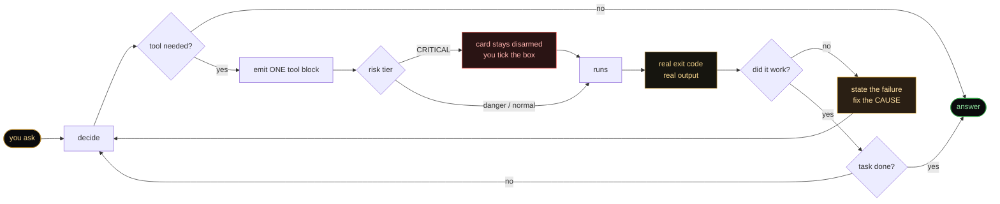
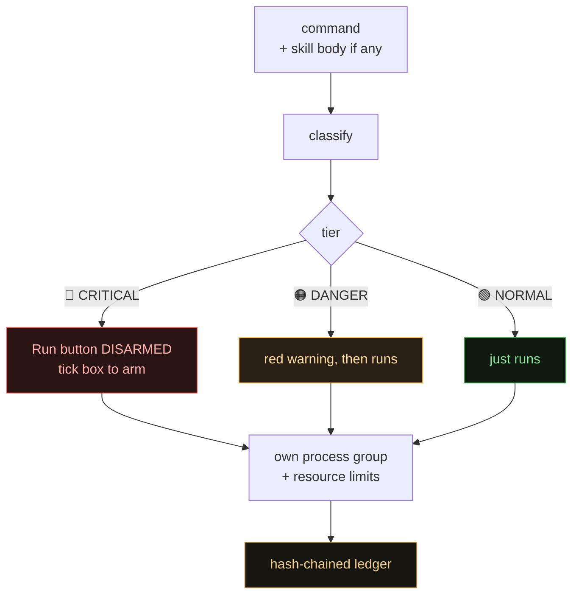
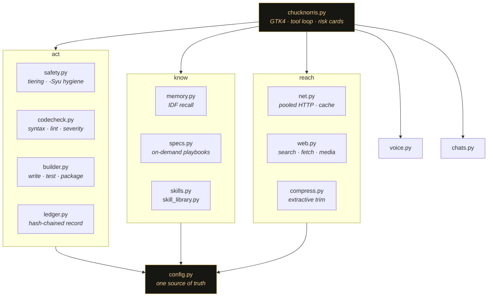

<div align="center">



<br>


<br><br>

[](https://github.com/the-priest/ChuckNorris/actions/workflows/tests.yml)


<br>

> ### *Chuck Norris doesn't `kill -9` a process.*
> ### *He looks at it, and it exits `0` out of respect.*

</div>

---

<div align="center">

## ⚡ THIRTY SECONDS ⚡

</div>

```bash
curl -fsSL https://raw.githubusercontent.com/the-priest/ChuckNorris/main/install.sh | bash
```
```bash
chucknorris
```

Paste a SiliconFlow key in Settings. Talk to him. That's the whole onboarding.

---

## 🥋 What this actually is

A **native GTK4 desktop agent** for Arch and CachyOS. Not a chat window with a search button glued on the side — an assistant that **decides what to do and then does it.** Searches the live web. Reads the actual pages. Runs commands on your real machine. Writes code, tests it, fixes it, hands you the zip.

> *Chuck Norris doesn't use a package manager.*
> *He tells the software where to live, and it moves in.*

**Now the honest part, up front where it belongs.** The *tooling* is local — your shell, your files, your projects, voice synthesis, code verification, chat history, all on your machine. The *model* is not. Chuck talks to the **SiliconFlow API**, so your prompts and the page text he gathers leave your box on the way to the model, exactly like every other hosted assistant.

He is a **local agent driving a remote brain.** That trade buys real access to your system plus a model far stronger than anything you'd fit on a desktop GPU. If it isn't a trade you want, that's an entirely reasonable position and you should stop reading here.

---

## 🔁 The loop

Every turn is the same shape, and the shape is the product. He does not get to claim success — the exit code decides.



**One command per reply. Always.** Run, verify, then the next. A wall of commands is unusable, and an agent that fires five and reads none of them is just a very confident random number generator.

---

## 🔥 What he can actually do

### 🌐 Research the live web

Searches multiple SearXNG instances — Brave, Google, DuckDuckGo and Bing underneath — with DuckDuckGo as backstop. Instances are probed in parallel, the searches in a round run concurrently, connections are pooled and kept alive, and a page read twice in one turn is read from memory the second time. Reads real pages. Cross-checks outlets. Cites URLs. Marks single-source claims `[UNVERIFIED]` rather than quietly promoting them to fact.

You watch it happen in a **live checklist** — `● searching…` → `✓ read bbc.com — headline` — each line ticking itself off as it lands. No mystery spinner, no wondering whether it died.

> *Chuck Norris doesn't get rate-limited.*
> *The API waits its turn.*

### ⚙️ He runs things. He does not suggest them.

A shell command **executes on your machine.** Chuck is an agent, not a suggestion box that makes you copy-paste your own homework.

Then he reads the **real exit code and real output**, confirms it did what he intended, and only then takes the next step. If it failed he says so and fixes the *cause*. He never carries on as though it worked.

Installing anything goes through `pacman -Syu`. A bare `-S` is **rewritten before it runs** — including inside saved skills, including for `paru` and `yay`. Partial upgrades are a rule enforced in code, not a polite request in a prompt the model can forget.

### 🛠️ Fix a real machine, carefully

Diagnose read-only first. Hypothesis out loud. **One change at a time.** Verify before moving on.

Before anything risky he says what could break and how to undo it — and for bootloader, initramfs, fstab or kernel work he hands you the **rescue path *before* you run it**, not in the postmortem. He won't rip out core packages, force-overwrite files pacman owns, or disable a check to make an error disappear.

If the output contradicts his theory, he says so and looks again. That sentence is the whole personality.

> *Chuck Norris doesn't chroot into a broken system.*
> *The system chroots into Chuck Norris and apologises.*

<details>
<summary><b>💻 Write, verify and run code</b> — every block checked before you see a Run button</summary>

<br>

Python, Node, Bash. Syntax, linting, static security scan. Broken code is withheld and he's told to fix it.

Findings are **split by severity**, which took a bug to learn:

| severity | examples | effect |
|---|---|---|
| `BLOCK` | `eval()`, `os.system()`, `shell=True`, `curl \| sh`, hard-coded secrets | Run button withheld, model told to fix |
| `ADVISE` | `md5`, `verify=False`, `innerHTML=`, `pickle.loads` | reported beside the card, **does not block** |

Treating everything as blocking meant a script that legitimately checksummed a file with `md5` could never reach a Run button — and the model, told to "fix every issue", had nothing to fix and looped until the hop budget ran out. Precision matters more than strictness.

He can also verify code **without running it**, which is useful for reviewing yours.

</details>

<details>
<summary><b>📦 Build entire projects</b> — written, tested, packaged, handed over</summary>

<br>

Ask for a tool. He opens a real project under `~/ChuckProjects/`, writes complete files (each verified as it lands), writes tests that assert real behaviour, **runs every one of them**, fixes what fails, then zips it and hands you a card with an *Open folder* button.

If the tests fail, **he tells you they failed.** He will not report success because the code looks about right.

</details>

<details>
<summary><b>🧠 Remember what matters</b> — IDF-ranked recall, not keyword soup</summary>

<br>

Durable facts persist across chats. Recall is IDF-weighted with conservative stemming, recency and hit-count damping.

| you ask | he recalls |
|---|---|
| *"my nvidia driver broke after the kernel update"* | the DKMS fact ✅ |
| *"what subnet is the server on"* | the network fact ✅ |
| *"searching a big source tree"* | the ripgrep preference ✅ |
| *"what's the weather like"* | **nothing at all** ✅ |

That last row is the hard one. Coverage gates, IDF ranks — gating on IDF instead collapses in a small store, where every word looks maximally distinctive. Only relevant facts surface each turn; the store is never dumped wholesale into the prompt. All of it visible and deletable in one panel.

</details>

<details>
<summary><b>🥷 Fourteen skills, shipped</b> — plus he writes new ones as he goes</summary>

<br>

System health checks · keyring-first safe updates · keyring repair · mirror ranking · disk cleanup · boot rescue · GPU inspection · passive domain recon · IP geolocation and ASN · security-header audits · listening-port audits · WiFi scan · authorised port scan.

One tap each. Saved skills are re-classified on their **body**, not their launcher, so nothing gets smuggled past the risk gate inside a script.

</details>

### 🔊 Talk — and it's on from the start

A natural **Piper** voice (espeak-ng fallback) reads replies **in full** by default, chunked and synthesised a step ahead of playback so long answers *finish* instead of dying mid-sentence. Every reply carries a **▶** to hear that one again. Stop silences everything instantly.

### 👁️ Plus

**Read your files** — root-owned ones come back as a `sudo cat` card. **Show your pictures** inline. **Find video** — cards, or `yt-dlp` it down. **Look at your screen** — send a screenshot and he'll tell you what's wrong with it. **Handle the rest** — Arch and recon are where he's deepest, not where he stops.

---

## 🛡️ Safety that doesn't get in your way

Commands run on their own. That is the entire point of an agent. What does **not** run on its own is anything catastrophic.



The tier is judged on **what will actually execute**, including a saved skill's body. The verifier is deliberately **static and never executes what it checks**, so there's no path around the gate through a verification step either.

**Stop means stop.** Send becomes Stop while he works, with a live `● working… 12s` counter. A watchdog stops him if anything truly hangs — sized off the *running command's own budget*, so a real twenty-minute `pacman -Syu` isn't mistaken for a hang and shot at the two-minute mark.

**Commands can't outlive their timeout.** Own process group, `RLIMIT_NPROC` / `RLIMIT_AS` / `RLIMIT_FSIZE` / `RLIMIT_CORE`, and a timeout kills the whole tree. No orphans quietly eating your box after Chuck has moved on.

**Your API key is 0600**, opened from the descriptor so there's never a window where it's world-readable.

**Every command is logged** — append-only, hash-chained JSONL, rotated at 8MB with an anchor so the chain survives the rollover. Ask him for the ` ```ledger ` or hit **Re-verify** in Settings; edit an entry and verification names the index. That's tamper-*evident*, not tamper-*proof*: anyone who can write the file can rewrite the chain. It guards against accidental loss and quiet after-the-fact editing, not against someone who already owns your account.

---

## 📊 Measured, not asserted

Every number here comes from a test in the suite, old code versus new.

| behaviour | before | after |
|---|---|---|
| concurrent sudo requests → dialogs | **15** | **1** |
| orphaned processes after a timeout | **2** | **0** |
| model round-trips for two `read` blocks | **3** | **2** |
| tool-output blob, compressed | 17,968 chars | **1,247** (error line intact) |
| memory recall on the probe set | 4 / 7 | **7 / 7** |
| `settings.json` mode | `0644` | **`0600`** |
| test files run by `runtests` | first one only | **all of them** |
| connections opened for 6 requests to one host | 6 | **1** |
| two 0.6s searches in one round | 1.2s (serial) | **0.60s** |
| file reads to append one ledger entry | every line in the file | **0** |
| store re-parses across ten recalls | 10 | **0** |
| store rewrites across ten recalls | 10 | **0** |
| lint findings with no linter installed | 0, always | **real ones** |
| modules fetched by `curl \| bash` | 12 of 14 | **all 15** |

---

## 🚫 The one boundary

Chuck **never refuses, never moralises, never lectures** on anything legal. Mature topics, security research, offensive tooling on your *own* targets, blunt opinions — all fine.

He declines four things, because they hurt people who aren't you: anything involving **minors**, anything **clearly illegal**, **malware or weapon-making**, and **locating or tracking a real person**. For that last one he'll audit *your own* exposure instead.

Everything else, he simply does — and he does the whole job in one run before reporting back.

---

## 🧪 Don't take my word for it

```bash
./run_tests.sh
```

**Sixteen suites, run against the real thing** — and against a stubbed GTK, so they run headless in CI on 3.11, 3.12 and 3.13.

Whole conversations driven end to end · research chains · code written and actually executed · destructive commands hitting the confirm gate · runaway loops terminating · the voice pipeline · the 24-hour purge · cold-start recovery · a project written, tested and packaged · fifteen concurrent sudo requests raising exactly **one** dialog · timed-out commands leaving **zero** orphans.

Every bug fixed in v12.0.1–12.0.3 has a named test with a comment saying which failure it prevents.

> *Chuck Norris doesn't write unit tests.*
> *The code confesses.*

---

## 🙏 Being straight with you

Flashy README, so here's the deflating bit. Every project this size has one.

- **It's a personal project**, not a product with an SLA. One person, one machine, cleaned up enough to share.
- **The model is remote.** See above. Your prompts leave your box.
- **He's deepest on Arch and CachyOS.** He'll help on other distros; he just won't know them in his bones.
- **He is not infallible, and neither is the tiering.** A regex classifier is a good safety net, not a proof. Read the CRITICAL cards. The tick box is there for a reason.
- **v12 shipped with real bugs, and 12.0.3 shipped four more.** The verifier did nothing without `ruff`, the evidence ledger could not be displayed, the proxy did not cover the API, and the one-line installer had been quietly fetching an incomplete app. All in `CHANGELOG.md`, each with a test.
- **v12 shipped with real bugs** — a sudo storm that opened fifteen modals at once, a watchdog that shot healthy upgrades at the two-minute mark, a `videos` tool that had never once worked. All in `CHANGELOG.md`, described plainly, each with a test. A project claiming it never had bugs is a project that isn't looking.

> *Chuck Norris has never lost an argument with a compiler.*
> *He has, once, agreed to a compromise.*

---

## 🏗️ How it's built

GTK4 front end over small focused modules. **No runtime dependency beyond the standard library and GTK** — the linters and voice engines are optional and degrade gracefully when absent.



<details>
<summary><b>module by module</b></summary>

<br>

| module | what it owns |
|---|---|
| `config.py` | paths, tunables, settings — one source of truth, written `0600` |
| `safety.py` | destructive-command classification, `pacman -Syu` hygiene |
| `net.py` | pooled keep-alive HTTP, page cache, proxy — one network layer |
| `web.py` | multi-engine search, page fetching, images, video |
| `voice.py` | speech: cleaning, chunking, synthesis, playback |
| `chats.py` | saved conversations and retention |
| `codecheck.py` | static verification: syntax, lint, security severity split |
| `builder.py` | sandboxed projects: write, test, package |
| `compress.py` | extractive context compression — cuts bulk, keeps errors |
| `ledger.py` | hash-chained record of every command run |
| `skills.py` · `skill_library.py` | saved and shipped recipes |
| `memory.py` · `specs.py` | durable facts, on-demand playbooks |

</details>

---

## 📥 Install

```bash
curl -fsSL https://raw.githubusercontent.com/the-priest/ChuckNorris/main/install.sh | bash
```

Or clone it, **read it first** (you should — see the CRITICAL tier above for why), then run it:

```bash
git clone https://github.com/the-priest/ChuckNorris.git chucknorris
```
```bash
cd chucknorris
```
```bash
./install.sh
```

The installer handles the lot: GTK4 + libadwaita, screenshot tool, polkit, `pacman-contrib`, `pciutils`, `pkgfile`, `espeak-ng` + **Piper** with a natural voice model, `yt-dlp`, the verifier linters (`shellcheck`, `ruff`), and the recon kit (`whois`, `bind`/`dig`, `traceroute`, `wget`, `netcat`) — plus the app and art.

## ⚙️ Set up

Open **Settings**, paste a **SiliconFlow** key ([get one here](https://cloud.siliconflow.com/account/ak)) — or Chuck reuses **Basilisk's** automatically if you have it.

While you're there: tune the voice, how deep he researches, how long chats live, how much transcript stays in RAM, and point him at your own SearXNG instance or a proxy.

```bash
chucknorris
```

Talk to him. That's it.

---

<div align="center">

<br>

> ### *Chuck Norris doesn't read man pages.*
> ### *Man pages read Chuck Norris and take notes.*

<br>

**MIT.** Made by **The Priest** ⛧

*In memory of a legend. 1940–2026.*

# 🥋

</div>
